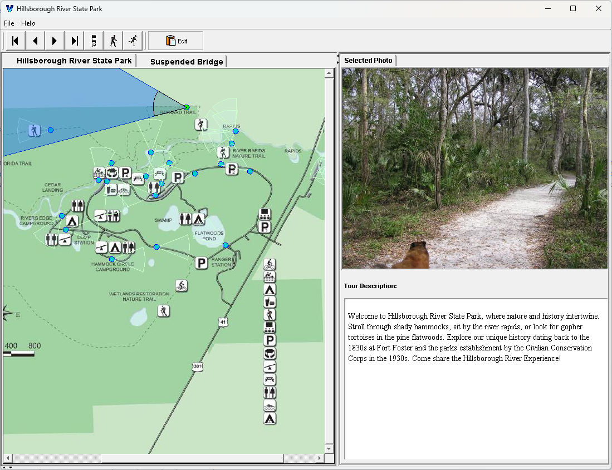

# vtoolkit (circa 2004)
Java Swing app built by Brett Shelley in 2004-ish - links photos to maps - years before google streetview

</img>

# description
Vadosity technology couples digital photo content with diagrams via a flexible format. Photos change as fast as you can move a mouse across any diagram, map, or aerial photo. In close proximity, directional motion simulation and movie effects occur. With maps and aerial photos, wide areas are virtually traversed at great speed and at the user s discretion. Vadosity allows you to navigate a map, satellite photo, sketch, floor plan, etc by moving your mouse across icons placed on the property layout image. The photos are tightly coupled with the map so that you know your location and orientation at all times. Every icon represents one or many still or panoramic photos with attached text descriptions. Version 2.0 contains significant enhancements that allow the integration of larger photos and a more dynamic application environment. Has newer tour format supports old, but allows for larger photo sizes. Much nicer and simpler windows look and feel. 
